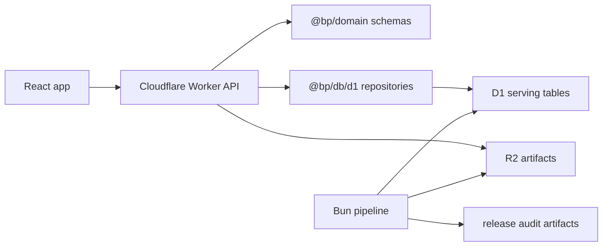

# Web API Endpoint Architecture

## Purpose

The newer web app is a mobile-first operational surface with a hotspot map, route detail panel, feed/digest, compare view, and route search. The API should support those surfaces without turning the public Worker into an analytics runtime.

The public app should read **serving projections** generated by the Bun pipeline:

- D1 for small indexed read models, rankings, status, and route/corridor summaries.
- R2 for larger artifacts such as GeoJSON, route briefs, evidence bundles, and source/audit manifests.
- Worker API handlers as a thin BFF layer that validates inputs, calls `@bp/db/d1` repositories, reads R2 artifacts by key, and returns strict domain response contracts.

No public endpoint should import `@bp/sources`, `@bp/analytics`, `tools/pipeline`, or `knowledge/`.

## Product Surfaces To Support

The current site direction needs these API-backed surfaces:

| Surface | Current frontend shape | API job |
|---|---|---|
| Map / hotspots | Full-viewport map with route hover/click and filter pills | Return ranked hotspot summaries plus map artifact URLs for the selected month/layer. |
| Nearby hotspot sheet | Route cards with grade, speed, bunching, trend | Return a compact feed sorted for triage, with completeness labels. |
| Route profile | Selected route detail panel | Return scorecard, brief summary, top hotspots, reliability, intervention context, source status, and artifact links. |
| Digest/feed | Scrollable insight feed | Return precomputed route/corridor insight cards, not raw rows. |
| Compare | Two-route comparison | Return normalized side-by-side route metrics and deltas. |
| Search | Route/corridor/street lookup | Return route/corridor suggestions from D1 plus optional static search index later. |
| Data status | Completeness labels and caveats | Return baseline/current/pending/observed release status per month and route. |

## Architecture



The Worker should be boring:

1. Parse `URL` and query params.
2. Validate route IDs, months, pagination, and filters with `@bp/domain` schemas.
3. Call one or two `@bp/db/d1` repository functions.
4. Optionally sign/read an R2 artifact by key.
5. Return a strict response schema with cache headers.

The pipeline owns all expensive work: source fetches, GTFS-RT parsing, geospatial matching, scoring, intervention analysis, route brief generation, and D1/R2 export.

## Endpoint Shape

Use `/api/v1` for the website-facing contract. Keep the existing `/api/health` and schema endpoints as compatibility shims while v1 is introduced.

| Endpoint | Reads | Purpose |
|---|---|---|
| `GET /api/v1/status` | D1 release/status and observed reliability tables | Latest baseline month, recovered/current realtime evidence, route coverage, completeness, and provenance. |
| `GET /api/v1/routes?month=YYYY-MM&limit=...&filter=...` | D1 route brief/readiness/score tables | Route list for search, feed, and ranked triage cards. |
| `GET /api/v1/routes/:routeId` | D1 route catalog | Static route metadata and available months/artifacts. |
| `GET /api/v1/routes/:routeId/profile?month=YYYY-MM` | D1 scorecard, brief summary, reliability, interventions, source status, artifact refs | Main route detail payload. |
| `GET /api/v1/hotspots?month=YYYY-MM&scope=network|corridor|route&routeId=...` | D1 hotspot/corridor tables | Compact hotspot list for feed and sheet. |
| `GET /api/v1/corridors?month=YYYY-MM` | D1 corridor summaries | Corridor-first browse and intervention context. |
| `GET /api/v1/compare?month=YYYY-MM&routeId=A&routeId=B` | D1 comparison ranks, brief summaries, reliability | Two-route comparison panel. |
| `GET /api/v1/map/manifest?month=YYYY-MM&layer=hotspots` | D1 artifact metadata plus R2 keys | Map layer manifest, not raw geometry inline. |
| `GET /api/v1/artifacts/*` | R2 artifact object | Controlled artifact reads for GeoJSON/briefs/audits when direct public R2 URLs are not used. |
| `GET /api/v1/search?q=...&month=YYYY-MM` | D1 route/corridor lookup; later R2 static index | Typeahead suggestions. |

## Response Contracts

Public response schemas live in `packages/domain/src/schemas.ts`. Start with three shared envelopes rather than a framework abstraction:

```ts
type ApiMeta = {
  schemaVersion: 1;
  generatedAt: string;
  baselineMonth: string;
  currentSignalMonth?: string;
};

type ApiDataQuality = {
  releaseLayer: "baseline_release" | "current_signal" | "pending_publication" | "observed_release";
  completenessStatus:
    | "complete"
    | "partial_realtime_only"
    | "partial_public_monthly_only"
    | "missing_speed"
    | "missing_realtime"
    | "insufficient_samples"
    | "source_lag_expected";
  confidence: "high" | "medium" | "low";
  caveats: readonly string[];
};

type ApiError = {
  error: {
    code: string;
    message: string;
  };
};
```

Each endpoint should include `meta` and, where metric claims are shown, `quality`. This is the product-level defense against source lag: the app can show what is complete, what is current-but-partial, and what should not be claimed yet.

Implemented first:

- `ReleaseStatusResponseSchema`
- `releaseStatusResponseJsonSchema`
- `GET /api/schema/release-status`
- `GET /api/v1/status`
- `RouteListResponseSchema`
- `routeListResponseJsonSchema`
- `GET /api/schema/route-list`
- `GET /api/v1/routes`
- `RouteProfileResponseSchema`
- `routeProfileResponseJsonSchema`
- `GET /api/schema/route-profile`
- `GET /api/v1/routes/:routeId/profile`
- `MapManifestResponseSchema`
- `mapManifestResponseJsonSchema`
- `GET /api/schema/map-manifest`
- `GET /api/v1/map/manifest`
- `GET /api/v1/artifacts/*`
- `HotspotListResponseSchema`
- `hotspotListResponseJsonSchema`
- `GET /api/schema/hotspots`
- `GET /api/v1/hotspots`
- `RouteCompareResponseSchema`
- `routeCompareResponseJsonSchema`
- `GET /api/schema/compare`
- `GET /api/v1/compare`

`/api/v1/status` reads the D1 route batch status plus route observed reliability summaries. It
infers `third_party_recovered` when the active run id starts with `bus-observatory-`, returns the
observed/insufficient route counts and sample count, and includes caveats distinguishing recovered
Bus Observatory evidence from official MTA monthly speed evidence.

`/api/v1/routes` reads D1 route brief summaries and observed reliability summaries for the selected
month, returns compact ranked route cards, and attaches per-route completeness labels. Routes with
`bus-observatory-*` observed reliability are labeled with medium-confidence third-party recovered
realtime caveats.

`/api/v1/routes/:routeId/profile` reads one D1 route brief summary, observed reliability summaries,
and route artifact metadata. It returns the compact route card, peak/slowest windows, observed
reliability metrics, and artifact references suitable for loading R2 route briefs or evidence
bundles without inlining large generated payloads.

`/api/v1/map/manifest` reads the generated R2 `map/<month>/manifest.json`, validates it against a
domain response schema, and adds `/api/v1/artifacts/*` fetch paths for each artifact. The artifact
proxy streams R2 objects with immutable cache headers and rejects invalid keys. This keeps map
geometry and larger static layers outside D1.

`/api/v1/hotspots` reads D1 corridor summaries and flattens precomputed corridor hotspot rows into
ranked compact cards. These are canonical monthly hotspot claims, not live current-state signals.

`/api/v1/compare` reads D1 route comparison ranks plus observed reliability summaries for two
routes, returns two compact route cards, and includes metric deltas. Recovered realtime evidence
retains the same medium-confidence provenance caveats as the route-card/profile endpoints.

## Recommended Payload Boundaries

### Route List

`GET /api/v1/routes` should return compact cards only:

- `routeId`, `shortName`, `longName`
- `routeScore`, `grade`, `rank`
- `averageSpeedMph`, `hotspotCount`
- `observedBunchingShare` or `null`
- `trend` if available from route-month trends
- `quality`

Do not include hotspot rows, citations, or geometry in this response.

### Route Profile

`GET /api/v1/routes/:routeId/profile` should be the main BFF endpoint for the selected route panel:

- scorecard
- route brief summary
- top hotspot rows
- observed reliability summary if available
- reliability baseline
- intervention comparisons
- source status map
- citations
- artifact links for full brief, route GeoJSON, and audit payloads

This gives the frontend one request after route selection while keeping the response small enough for edge serving.

### Hotspots

`GET /api/v1/hotspots` should return pre-ranked summaries. It should not expose raw segment-speed rows. Add route/corridor scopes as query params instead of separate endpoints until the need diverges.

### Map Manifest

`GET /api/v1/map/manifest` should return artifact metadata:

- layer ID
- month
- metric
- R2 key or public URL
- content type
- byte length
- SHA-256
- source/cadence caveat

The map should fetch GeoJSON/PMTiles as static artifacts. D1 should only identify which artifact to use.

## D1 Repository Mapping

The repo already has most read-model repositories needed for the endpoints:

| API need | Existing query module |
|---|---|
| route scorecard | `route-scorecard.ts` |
| route profile summary | `route-brief-summaries.ts` |
| route comparison | `route-comparison-ranks.ts`, `route-intervention-comparisons.ts` |
| observed reliability | `route-observed-reliability.ts` |
| reliability baseline | `route-reliability-baselines.ts` |
| readiness/completeness | `route-readiness.ts`, `source-statuses.ts`, `route-batch-status.ts` |
| corridors | `corridor-summaries.ts` |
| artifacts | `brief-artifacts.ts` |

Missing or likely additions:

- A compact `listRouteCards` repository for `GET /api/v1/routes`.
- A `listHotspotCards` repository that can read route and corridor hotspot projections.
- A release/status repository or R2-backed reader for the latest pipeline-v1 audit manifest.
- Public domain schemas for `RouteCard`, `RouteProfile`, `HotspotCard`, `MapManifest`, and `ReleaseStatus`.

## Caching

Use cache policy by data layer:

| Data kind | Suggested cache |
|---|---|
| baseline monthly release | `Cache-Control: public, max-age=3600, stale-while-revalidate=86400` |
| R2 immutable artifacts with hash | `public, max-age=31536000, immutable` |
| current signal / GTFS-RT appendix summaries | `public, max-age=60, stale-while-revalidate=300` |
| health/status | `no-store` or short max-age |
| schema endpoints | long cache if schema versioned |

R2 artifact keys should include month and content hash or manifest SHA where practical so the frontend can cache aggressively without stale metric risk.

## Error Semantics

Use consistent error codes:

- `bad_month`
- `bad_route_id`
- `missing_required_param`
- `not_found`
- `dataset_unavailable`
- `artifact_unavailable`
- `d1_unconfigured`
- `r2_unconfigured`

Missing data should usually be a `200` with `quality.completenessStatus`, not a `500`. A `404` means the route/artifact truly is not part of the serving projection. A delayed source month should surface as `source_lag_expected`.

## Implementation Order

1. Add domain response schemas for `ReleaseStatus`, `RouteCard`, `HotspotCard`, `RouteProfile`, and `MapManifest`.
2. Add D1 query helpers for route cards, hotspot cards, and release status.
3. Add Worker router helpers under `apps/web/src/worker/` with small per-endpoint handler files.
4. Add Worker tests for the happy path, invalid month/route, missing D1/R2 binding, and source-lag response.
5. Replace frontend fixtures one surface at a time:
   - status and route list
   - hotspots sheet
   - route profile
   - compare
   - map manifest/artifacts
6. Keep fixture fallback only for story/demo modes, not default production behavior.

Current implementation status:

| Item | Status |
|---|---|
| Release status schema | Implemented |
| `/api/v1/status` | Implemented and Worker-tested |
| Route list/card schema | Implemented |
| `/api/v1/routes` | Implemented and Worker-tested |
| Route scorecard endpoint | Existing compatibility endpoint |
| Route profile BFF endpoint | Implemented and Worker-tested |
| Hotspot cards endpoint | Implemented and Worker-tested |
| Compare endpoint | Implemented and Worker-tested |
| Map manifest/artifact endpoint | Implemented and Worker-tested |
| Frontend fixture replacement | Partially implemented: hotspots, route profile, and compare loaders are API-first with fixture fallback; map route lines hydrate from `/api/v1/map/manifest` artifacts with fixture first-paint fallback |

## Non-Goals For This API

- Do not query Socrata, MTA Bus Time, Bus Observatory, or NYC Open Data from request handlers.
- Do not compute route scores, geospatial matches, headways, or intervention effects in the Worker.
- Do not put raw monthly segment speed rows or raw GTFS-RT rows behind public endpoints.
- Do not grow D1 into a warehouse; serve compact projections and artifact metadata.
- Do not use app runtime imports from `knowledge/`.

## Open Questions

1. Should R2 artifacts be public URLs from manifests, or proxied through `/api/v1/artifacts/*` for cache/header control?
2. Should route profile be one aggregated BFF payload or separate tab endpoints once the UI stabilizes?
3. Should the current-signal layer refresh from Worker-captured R2 manifests only after pipeline finalization, or expose a raw capture-status endpoint too?
4. What exact route grading scale should the UI display when `routeScore` is present but observed realtime reliability is missing?
