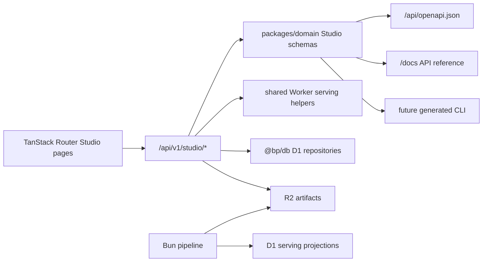

# Web API Endpoint Architecture

## Purpose

The website hard cutover changed the product from a map-led panel app into a route-first evidence
studio. The next API task is to keep product-shaped Studio endpoints as the only frontend contract,
with local seed data limited to tests/artifact generation and
`apps/web/src/fixtures/demo-snippets.ts` kept dev-only.

This is a hard cutover. Production Studio pages must not keep legacy endpoint fallbacks, fixture
fallback loaders, or "try API, then sample data" branches.

The Worker API remains a thin edge BFF:

- Validate request params and query.
- Read D1 serving projections and R2 artifacts.
- Return strict `packages/domain` response contracts.
- Add observability headers/logs.
- Never import source adapters, analytics transforms, `tools/pipeline`, or `knowledge/`.

Brief/composer/data-loading support is tracked in
[[web_app_support_plan|Web App Support Plan]]. Use that page for route-loader cache policy, deferred
brief evidence/history payloads, and draft/composer endpoint sequencing.

AI-facing API resources must follow [[wiki/project/ai_interaction_model|AI Interaction Model]]:
LLM output is represented as Studio artifacts such as findings, reasoning trails, diagnosis text,
claim seeds, caveats, and brief drafts. Do not add a global chat endpoint or expose free-form
LLM replies as a public product resource.

Public API URLs are RESTful product resources, not object-store paths. R2 keys such as
`studio/v1/routes/m15-sbs/index.json` are private storage keys behind the Worker. The frontend,
OpenAPI document, docs, and future agent/CLI surfaces must depend on `/api/v1/studio/*` resources
only. Do not expose R2 projection keys in public links, client code, OpenAPI paths, or response
headers; use release-level provenance such as `X-Studio-Release` when debugging needs a stable
identifier.

## REST Over Private Projections

Prefer a RESTful Studio API over exposing D1 rows or R2 objects directly.

The product contract should be stable resources:

- `/api/v1/studio/routes`
- `/api/v1/studio/routes/:routeId`
- `/api/v1/studio/routes/:routeId/ladder`
- `/api/v1/studio/findings/:findingId`
- `/api/v1/studio/briefs/:briefId`
- `/api/v1/studio/docs`

D1 and R2 are implementation details behind those resources. The best backend shape is a
projection-backed BFF:

1. The Bun pipeline reads local/D1 serving tables and source/artifact manifests.
2. The pipeline materializes strict `packages/domain` Studio projection JSON files for each public
   resource shape.
3. The publish step uploads those projections and referenced artifacts to R2 under versioned
   private keys.
4. The Worker maps REST URLs to private projection keys, validates every response with the same
   Effect Schema contracts, and fails closed when a projection is missing or invalid.

This keeps the API RESTful without forcing every request to join route summaries, route-slice
artifacts, brief artifacts, finding metadata, and docs metadata at the edge. It also avoids leaking
storage keys, lets Lighthouse/smoke tests run against the exact public URLs, and gives agents a
small, predictable API surface.

Do not add a public API like `/api/v1/studio/objects/:key`, `/api/v1/studio/projections/*`, or
`/api/v1/r2/*`. If an object needs to become public, model it as a product resource first, then map
that resource to whichever D1/R2 inputs back it.

The pipeline still owns expensive work: source fetches, GTFS-RT parsing, geospatial construction,
hotspot scoring, intervention evaluation, route brief generation, artifact builds, and D1/R2 export.

## API Package Refactor

The next backend refactor should be **package-first, app-later**. See
[[wiki/engineering/studio_api_refactor_plan|Studio API Refactor Plan]].

Planned shape:

```text
apps/web Worker
  -> assets, SPA fallback, edge SEO
  -> delegates /api/* to packages/studio-api
  -> delegates scheduled refresh to packages/studio-api
  -> re-exports BriefAuthorAgent from packages/studio-api
```

This keeps the current deployment simple while making the API portable. A future `apps/api` Worker
should be a thin wrapper around the same package only after SSR, least-privilege binding separation,
independent API deploys, or external API versioning justifies the extra Cloudflare routing and
cookie surface.

`packages/studio-api` is allowed to be Cloudflare-edge runtime code. It may depend on
`@bp/domain`, `@bp/db`, Workers request/response primitives, D1, R2, Workers AI, cookies, and
headers. It must not import React, TanStack Router route modules, `apps/*`, `tools/*`,
`knowledge/*`, `@bp/sources`, `@bp/analytics`, or `@bp/applied-research`.

The extraction order should be:

1. Move HTTP helpers, projection readers, cache headers, request-id, structured logging, and
   app/D1/R2 `Server-Timing` helpers.
2. Move Studio read endpoints, including the planned `GET /api/v1/studio/snapshot`.
3. Move auth and brief authoring write endpoints.
4. Move source-refresh cron and `BriefAuthorAgent` exports.
5. Add `apps/api` only if the gates above are met.

## Hard Cutover Rules

- Production Studio pages call `/api/v1/studio/*` only.
- Non-Studio `/api/v1/*` endpoints may remain temporarily for external compatibility and migration
  tests, but they are not a frontend fallback path.
- Worker Studio handlers may reuse extracted repository/helper code, but should not fetch their own
  payloads by making HTTP requests to legacy endpoints.
- Missing data is represented in the Studio response as a designed unavailable section with
  `quality`, not by falling back to sample data.
- `apps/web/src/studio/sample-data.ts` is not a production runtime source. It may be used to build
  or test versioned Studio R2 projection artifacts, but routes, pages, components, and Worker
  handlers must not import it.
- `apps/web/src/fixtures/demo-snippets.ts` is for dev examples and `/system` only.
- Completion requires a repo-boundary check that fails if production runtime files import
  `studio/sample-data.ts`, `fixtures/demo-snippets.ts`, or deleted legacy panel loaders.

## Current State

Existing `/api/v1` endpoints are compatibility endpoints and implementation references:

| Existing endpoint | Cutover posture | Role |
|---|---|---|
| `GET /api/v1/status` | keep | Release/completeness status; can feed Studio bootstrap through shared helper code |
| `GET /api/v1/routes` | temporary | Compact route cards from D1; replace frontend use with `GET /api/v1/studio/routes` |
| `GET /api/v1/routes/:routeId/profile` | temporary | Existing route profile read model; replace frontend use with `GET /api/v1/studio/routes/:routeId` |
| `GET /api/v1/hotspots` | temporary | Precomputed hotspot cards; replace page use with Studio findings/route detail contracts |
| `GET /api/v1/compare` | temporary | Existing comparison read model; replace frontend use with `GET /api/v1/studio/compare` |
| `GET /api/v1/map/manifest` | keep | R2-backed artifact manifest, used by evidence/map modules through Studio refs |
| `GET /api/v1/artifacts/*` | keep | Controlled R2 artifact proxy |
| `GET /api/schema/*` | temporary | JSON Schema compatibility until generated OpenAPI covers public contracts |

The hard-cutover slice is now wired. `packages/domain/src/studio-schemas.ts` defines the route-first
Studio contracts, `packages/domain/src/studio-projections.ts` builds page-shaped projection
responses, `apps/web/src/studio/api-contract.ts` re-exports the contracts for local web imports, the
Worker serves RESTful `/api/v1/studio/*` resources from versioned `studio/v1/*.json` R2 projection
artifacts, and TanStack Router loaders call those API resources directly. If a required projection
artifact is missing or invalid, Studio endpoints fail closed; there is no Worker fallback to local
seed data and no frontend legacy endpoint branch.

The brief-draft authoring slice is now wired as a narrow live-write exception to the R2 projection
model. `/api/v1/studio/briefs/:briefId/draft*` routes read and write D1 draft rows through the
`@bp/db/d1` query layer, require an ADR 0008 `bp_session` operator role, and validate all request and
response bodies with `packages/domain` draft schemas. Public brief reads stay anonymous; when a
request has `read:briefs` for the draft workspace, `GET /api/v1/studio/briefs/:briefId` overlays
D1 draft title/dek/summary/version/claims plus `draftStatus` and `draftPublishedAt`. Anonymous and
non-operator reads keep the R2 projection with draft fields `null`.

`bun run build:studio-release` now delegates to the pipeline command
`@bp/pipeline build:studio-release`. That command loads the D1 export schema/seed, reads generated
route-slice artifacts, builds a strict `StudioReleasePayload`, and writes page-shaped endpoint
projections such as `studio/v1/routes.json`, `studio/v1/routes/:slug/index.json`,
`studio/v1/findings/:findingId/index.json`, and `studio/v1/briefs/:briefId/index.json`. The old
web-app sample-data generator has been removed from the release script path.

Future implementation can enrich the projection content with additional D1 repositories or R2
artifact bundles, but it should keep the same public REST resource boundary. Do not add a dual-read
frontend migration layer.

## Versioning

Use `/api/v1/studio/*` for route-first product contracts.

Keep non-Studio `/api/v1/*` endpoints stable only where they are already public or operationally
useful. They should not appear in new page loaders. After Studio pages are fully wired, audit which
temporary endpoints can be deleted or hidden from generated docs.

Generate `GET /api/openapi.json` from runtime TypeScript/Zod schema values when the Studio contract
set stabilizes. OpenAPI is an output, not the source of truth.

## Architecture



Handler shape:

```text
parse request
  -> validate params/search
  -> read versioned projection from R2, or D1/R2 through narrow helpers for compatibility endpoints
  -> normalize source/completeness caveats
  -> schema-parse response
  -> emit Server-Timing and structured log
```

## Shared Contract Envelope

> **De-month status (2026-07-12):** the month-keyed API metadata and caching mechanics below remain
> live but are scheduled for removal per ADR-0022 — serving contract in plan 085, release identity
> in plan 086, and freshness ledger in plan 087. Until those land, this describes current behavior.

Every Studio response should include:

```ts
type StudioApiMeta = {
  schemaVersion: 1;
  generatedAt: string;
  baselineMonth: string;
  currentSignalMonth?: string;
  releaseLayer: "baseline_release" | "current_signal" | "pending_publication" | "observed_release";
};

type StudioDataQuality = {
  completenessStatus:
    | "complete"
    | "partial_realtime_only"
    | "partial_public_monthly_only"
    | "missing_speed"
    | "missing_realtime"
    | "insufficient_samples"
    | "source_lag_expected";
  confidence: "high" | "medium" | "low";
  caveats: readonly string[];
};

type StudioApiError = {
  error: {
    code: string;
    message: string;
  };
};
```

Do not hide source gaps. If a section cannot make a claim from D1/R2, return a section-level
unavailable state with `quality`, not a fabricated value.

## Read API

Implement read endpoints first. These unblock the website and docs without introducing persistence
or authorization questions.

| Endpoint | Purpose | Initial backing |
|---|---|---|
| `GET /api/v1/studio/bootstrap` | Shell/navigation metadata, release status, primary months | D1 release status helper plus static route metadata |
| `GET /api/v1/studio/routes` | Home route cards, search-first ranking, quick filters | D1 route card repository plus route metadata |
| `GET /api/v1/studio/search?q=` | Grouped results for routes, segments, briefs, methods | D1 route lookup plus R2/static index later |
| `GET /api/v1/studio/routes/:routeId` | Route detail KPIs, diagnosis, chart refs, slow segments, intervention potential | D1 route profile repositories plus segment/evidence artifacts |
| `GET /api/v1/studio/routes/:routeId/ladder` | Ordered segment ladder with treatment glyphs and hourly severity | Route-segment artifact from R2 plus D1 summaries |
| `GET /api/v1/studio/compare?a=&b=` | Symmetric route comparison for the new compare page | D1 comparison repositories plus route metadata |
| `GET /api/v1/studio/findings` | AI/discovery feed cards | New D1/R2 finding projection |
| `GET /api/v1/studio/findings/:findingId` | Reasoning trail and evidence bundle behind a finding | New R2 finding/evidence artifact |
| `GET /api/v1/studio/briefs` | Brief gallery cards | Existing brief artifacts manifest plus D1 route metadata |
| `GET /api/v1/studio/briefs/:briefId` | Published brief body, claims, citations, caveats | R2 brief JSON/Markdown artifact |
| `GET /api/v1/studio/briefs/:briefId/evidence` | Citation drill-down data | R2 evidence artifact bundle |
| `GET /api/v1/studio/briefs/:briefId/history` | Version list and diff payload | R2 brief history artifact; later D1 if mutable |
| `GET /api/v1/studio/methods` | Dataset cards, metrics, caveats, glossary | Generated docs/source registry projection |
| `GET /api/v1/studio/docs` | API docs/changelog/data credits metadata | Generated from runtime schema and docs markdown |
| `GET /api/openapi.json` | Public OpenAPI for agents/SDKs | Generated from runtime schema |

## Write/Composition API

The brief-draft subset is implemented in the Worker. These routes are still bounded authoring
endpoints, not a general collaboration API. All draft mutations require `Idempotency-Key`; authz
comes from `identity_session` + `studio_actor_role` scopes (`write:briefs`, `review:briefs`,
`publish:briefs`). Generation records a job and returns the job response without running LLM
inference inline. When `AI` and `BRIEF_AUTHOR_AGENT` bindings are present, the Worker signals the
Cloudflare Think `BriefAuthorAgent` to run Workers AI out-of-band and store a proposal for human
approval; missing bindings still fail closed as `not_configured`.

| Endpoint | Purpose | Backing/auth |
|---|---|---|
| `POST /api/v1/studio/briefs` | Create a new draft-only brief from a route, source brief, or finding seed. | D1 draft row plus optional seed claims; `write:briefs` |
| `PATCH /api/v1/studio/briefs/:briefId/draft` | Edit draft metadata/status/body markdown. | D1 draft row; `write:briefs` |
| `POST /api/v1/studio/briefs/:briefId/draft/generate` | Queue a Think / Workers AI generation run. | D1 job + agent run fields; `write:briefs`; no inline inference; valid model output becomes a proposal |
| `POST /api/v1/studio/briefs/:briefId/draft/agent-runs` | Start an authoring agent run against the current draft version/hash. | D1 agent run row; `write:briefs`; no inline inference |
| `GET /api/v1/studio/briefs/:briefId/draft/agent-runs/:runId` | Fetch one authoring agent run. | D1 agent run row; `read:briefs` |
| `POST /api/v1/studio/briefs/:briefId/draft/agent-runs/:runId/propose-edit` | Validate and store structured proposed edits. | D1 proposal row; `write:briefs`; returns repair/stale-base feedback instead of mutating accepted draft content |
| `GET /api/v1/studio/briefs/:briefId/draft/proposals/:proposalId` | Fetch a stored agent proposal. | D1 proposal row; `read:briefs` |
| `POST /api/v1/studio/briefs/:briefId/draft/proposals/:proposalId/apply` | Apply all or selected approved proposal operations. | D1 proposal + draft rows; `write:briefs`; creates a draft version snapshot |
| `POST /api/v1/studio/briefs/:briefId/draft/proposals/:proposalId/reject` | Reject a stored agent proposal. | D1 proposal row; `write:briefs`; accepted draft content is unchanged |
| `GET /api/v1/studio/briefs/:briefId/draft/versions` | List draft version milestones. | D1 version rows; `read:briefs` |
| `POST /api/v1/studio/briefs/:briefId/draft/versions/:versionId/restore` | Restore a D1-backed draft version snapshot as a new version. | D1 draft/version/snapshot rows; `write:briefs` |
| `POST /api/v1/studio/briefs/:briefId/draft/claims` | Add claim. | D1 claim row; `write:briefs` |
| `PATCH /api/v1/studio/briefs/:briefId/draft/claims/:claimN` | Edit claim text/evidence/caveats/state. | D1 claim row; `write:briefs` |
| `DELETE /api/v1/studio/briefs/:briefId/draft/claims/:claimN` | Remove a claim and renumber later claims. | D1 claim rows; `write:briefs` |
| `POST /api/v1/studio/briefs/:briefId/draft/blocks` | Add a typed primitive block. | D1 block row; `write:briefs` |
| `PATCH /api/v1/studio/briefs/:briefId/draft/blocks/:blockId` | Edit a typed primitive block. | D1 block row; `write:briefs` |
| `DELETE /api/v1/studio/briefs/:briefId/draft/blocks/:blockId` | Remove a typed primitive block. | D1 block row; `write:briefs` |
| `POST /api/v1/studio/briefs/:briefId/draft/refs/resolve` | Validate/normalize proposed content-graph refs. | Domain `BriefRef` schemas plus D1/R2 lookup for block, evidence, metric, source, and artifact refs; `write:briefs` |
| `GET /api/v1/studio/briefs/:briefId/draft/refs` | List persisted content-graph refs. | D1 ref rows; `read:briefs` |
| `PUT /api/v1/studio/briefs/:briefId/draft/refs` | Replace persisted content-graph refs after normalization. | D1 ref rows; `write:briefs` |
| `POST /api/v1/studio/briefs/:briefId/draft/attach` | Attach a captured Studio object as a typed block, body directive, and refs. | D1 block/ref rows plus body markdown; `write:briefs` |
| `GET /api/v1/studio/briefs/:briefId/draft/comments` | List draft-private review threads and replies. | D1 review rows; `read:briefs` |
| `POST /api/v1/studio/briefs/:briefId/draft/comments` | Create an anchored comment, change request, or suggested edit. | D1 review rows; `review:briefs` |
| `POST /api/v1/studio/briefs/:briefId/draft/comments/:commentId/replies` | Reply to a review thread. | D1 review rows; `write:briefs` or `review:briefs` |
| `PATCH /api/v1/studio/briefs/:briefId/draft/comments/:commentId` | Resolve, dismiss, reopen, or edit a review thread. | D1 review rows; `write:briefs` or `review:briefs` |
| `POST /api/v1/studio/briefs/:briefId/draft/comments/:commentId/accept-suggestion` | Apply a body-markdown suggested edit. | D1 draft body + review rows; `write:briefs` |
| `POST /api/v1/studio/briefs/:briefId/draft/validate` | Run deterministic validation. | D1 validation fields; checks claim strength/evidence plus body block refs; `write:briefs` |
| `POST /api/v1/studio/briefs/:briefId/draft/review` | Add review request/comment and move to review. | D1 review comments; `review:briefs` |
| `POST /api/v1/studio/briefs/:briefId/draft/verdict` | Approve a draft or request changes without publishing. | D1 draft status plus optional review comment; `review:briefs` |
| `POST /api/v1/studio/briefs/:briefId/draft/publish` | Mark the draft as a publish candidate. | D1 status/published_at; `publish:briefs` |
| `POST /api/v1/studio/briefs/:briefId/draft/retract` | Retract a publish candidate. | D1 status; `publish:briefs` |
| `POST /api/v1/studio/briefs/:briefId/draft/promotion-receipt` | Record that offline projection promotion completed. | D1 promotion receipt fields; `publish:briefs` |
| `GET /api/v1/studio/briefs/:briefId/draft/publish-candidate-export` | Return the publish-candidate export payload plus private audit. | D1 draft + R2 route/brief projection; `publish:briefs` |

Still unimplemented: reviewer notification delivery, reviewer assignment endpoints, the searchable
evidence catalog, and UI streaming for live agent progress. The
collaboration and promotion model is tracked in
`docs/architecture/studio-review-collaboration-and-promotion.md`: review threads stay draft-private
under `.../draft/comments*`, while public promotion remains an offline pipeline projection step fed
by a validated candidate export and finalized by a promotion receipt.

Do not use D1 as an unbounded collaboration/event log. If drafts become a real multi-user product,
record the storage/auth decision before implementation.

For the single-user MVP composer, D1 may hold bounded draft metadata, draft body markdown, typed
block rows, claim text, evidence refs, and review comments. Large generated artifacts, diff
snapshots, and publish candidates should live in R2 with D1 storing only refs and hashes. Published
release projections remain immutable until an explicit promotion step updates them.

## Response Shapes By Page

### Home / Routes

`GET /api/v1/studio/routes` returns:

- route identity: slug, route id, label, SBS flag, borough, corridor
- rank/attention reason
- speed, scheduled speed, rider-hours lost, lane coverage
- release/completeness label
- sparkline data or R2 chart ref
- top finding/brief ids when available

### Route Detail

`GET /api/v1/studio/routes/:routeId` returns:

- route identity and SEO title/description
- KPI strip
- AI diagnosis text with attribution metadata
- speed trend chart data or chart artifact ref
- intervention potential scenario with caveat
- slow segment table rows
- related briefs/findings
- source/caveat list

### Route Ladder

`GET /api/v1/studio/routes/:routeId/ladder` returns:

- ordered segment ids
- direction/from/to labels
- observed vs scheduled speed
- rider-hour impact
- hourly severity array
- treatment state: lane, ACE, TSP
- evidence refs for each segment

### Findings

Findings are not chatbot output. They are precomputed discovery objects that follow the AI
interaction model:

- id, category, title, summary
- route/segment refs
- metric that triggered it
- confidence and caveats
- reasoning trail events
- evidence bundle refs
- brief creation seed

### Briefs

Published briefs should be artifact-first:

- brief metadata from D1/R2 manifest
- narrative body as Markdown/HTML
- claims array with evidence/caveat counts
- citation refs
- source and computation notes
- history/diff refs

## Error Semantics

Use consistent error codes:

- `bad_month`
- `bad_route_id`
- `bad_brief_id`
- `bad_finding_id`
- `missing_required_param`
- `not_found`
- `dataset_unavailable`
- `artifact_unavailable`
- `d1_unconfigured`
- `r2_unconfigured`
- `feature_disabled`

Missing data should usually be `200` with section-level quality/unavailable state. Use `404` when
the entity is not part of the serving projection. Use `503` for missing bindings in production.

## Caching

| Data kind | Cache |
|---|---|
| Monthly baseline Studio responses | `public, max-age=3600, stale-while-revalidate=86400` |
| R2 immutable artifacts with hash | `public, max-age=31536000, immutable` |
| Current signal appendices | `public, max-age=60, stale-while-revalidate=300` |
| Write/composition endpoints | `no-store` |
| OpenAPI/schema endpoints | long cache when versioned |
| Observability endpoints | `no-store` |

Use `ETag` or artifact hashes for R2-backed payloads where practical.

## Observability

Every Studio handler should emit:

- `Server-Timing` for app/D1/R2 durations.
- Structured log row with route template, status, duration, release month, and request id.
- No secrets, API keys, or raw user query text beyond sanitized search terms.

See `knowledge/wiki/engineering/web_observability_performance_seo_plan.md` for the full
observability and Lighthouse gate plan.

## Immediate Implementation Order

### Step 1: Runtime Contracts

- Current slice: Studio contracts live in `packages/domain/src/studio-schemas.ts`, and
  `apps/web/src/studio/api-contract.ts` is now only a compatibility re-export.
- Current slice: Studio response and release-payload JSON Schema exports are available from
  `@bp/domain`, and `GET /api/openapi.json` serves a generated OpenAPI 3.1 document for the Studio
  read contracts.
- Keep release-artifact tests that parse the current local seed into `StudioReleasePayloadSchema`;
  the seed is not a production runtime source.

### Step 2: Read Endpoint Skeleton

- Current slice: the Worker serves `routes`, `search`, route detail, ladder, compare, findings,
  briefs, methods, and docs under `/api/v1/studio/*` from versioned page-shaped R2 projection
  artifacts such as `studio/v1/routes.json`, `studio/v1/routes/:slug/index.json`,
  `studio/v1/routes/:slug/ladder.json`, `studio/v1/findings.json`, and
  `studio/v1/briefs/:briefId/index.json`.
- Current slice: Studio responses are schema-validated and emit `Server-Timing: studio`.
- Current slice: `bun run build:studio-release` writes the current
  `data/artifacts/studio/v1/release.json` audit artifact plus page-shaped endpoint projections for
  R2 upload, and the serving publish script includes `data/artifacts/studio/*`.
- Next: extract the Studio API into `packages/studio-api` before creating any separate `apps/api`
  deployment. Start with shared `Cache-Control`, request-id, app/D1/R2 timing, structured logging,
  and R2 projection helpers.
- Next: generate the page-shaped `studio/v1/*.json` projections from D1/R2 sources instead of the
  local seed.
- Add Worker tests for `GET /api/v1/studio/snapshot` once snapshot/nav metadata is introduced.

### Step 3: Hard-Cutover Frontend Reads

- Current slice: route loaders fetch Studio endpoints for routes, search, route detail, ladder,
  compare, findings, briefs, methods, and docs.
- Current slice: API `404` responses render the designed not-found state; no page loader falls back
  to sample data or non-Studio endpoints.
- Current slice: direct imports from `studio/sample-data.ts` were removed from production pages.
- Current slice: `fixtures/demo-snippets.ts` remains dev-example-only.
- Current slice: the web architecture check and production-boundary harness reject production
  runtime imports from sample/demo data, including Worker handlers.

### Step 4: Findings And Brief Artifacts

- Define finding projection artifact and brief evidence artifact schemas.
- Add R2 readers and manifest validation.
- Wire findings, brief reading, evidence, and history pages.

### Step 5: OpenAPI And Docs

- Current slice: `GET /api/openapi.json` is generated from package-level Studio JSON Schema exports.
- Current slice: `GET /api/v1/studio/docs` derives its endpoint table from the generated OpenAPI
  paths.
- Add changelog and data credits sections with agent-readable Markdown.

### Step 6: Composition Design

- Decide draft storage/auth/review model.
- Only then implement write endpoints.

## Verification

For each endpoint slice:

- `bun run check:types`
- `bun run check:style`
- `bun run test:web`
- `bun run test:worker`
- response schema parse tests
- local route smoke with the dev server
- Lighthouse/SEO route matrix after frontend pages switch to loaders

Do not declare the API migration complete while any production runtime imports
`studio/sample-data.ts` for page/API content or calls non-Studio endpoints as fallback reads.
